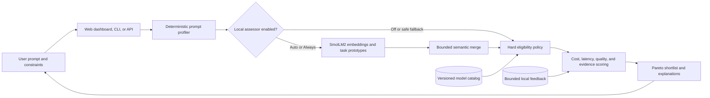

# Routellect

**Know the right model before you run.**

Routellect is a private, evidence-backed advisor that recommends an LLM and inference configuration for a prompt. It balances quality, cost, latency, capabilities, and privacy without calling the recommended model.

## What makes it different

- Advisory-only: no provider keys, proxy, model execution, or spend.
- Hybrid intelligence: deterministic fast path plus an opt-in, bounded local language-model
  embedding signal for uncertain prompts.
- Auditable: hard constraints and deterministic scoring own the final decision.
- Honest estimates: ranges, confidence, dated sources, and explicit stale-data warnings.
- Private feedback: structured outcomes without raw-prompt retention.
- One rootless Podman container, one port, one volume.

## Architecture at a glance



The recommended model is never called. The local assessor can refine prompt understanding, while
deterministic policy remains the final authority for privacy, eligibility, ranking, and cost. See
[the detailed architecture](docs/architecture.md) for component, data-flow, privacy, feedback, and
Podman deployment diagrams.

## Quick start with Podman

```sh
podman build --format docker -t routellect:0.5.0 .
podman volume create routellect-data
podman run --rm --name routellect \
  --read-only --tmpfs /tmp:rw,noexec,nosuid,size=128m \
  --cap-drop=all --security-opt=no-new-privileges \
  -p 8080:8080 -v routellect-data:/data:Z \
  routellect:0.5.0
```

Open `http://127.0.0.1:8080`.

The image bundles the local assessor and can operate offline after build. Deterministic policy owns
the final decision; the local assessor is only a bounded second opinion for uncertain prompts.
Select Auto or Always in the dashboard, or pass `--assessor auto|always` to the CLI.

## Local development

Use Python 3.12 and Node.js 22 or newer:

```sh
python3.12 -m venv .venv
.venv/bin/pip install -e '.[dev]'
cd frontend && corepack pnpm install && corepack pnpm build && cd ..
.venv/bin/uvicorn routellect.api:app --reload
```

Run checks:

```sh
.venv/bin/ruff check src tests
.venv/bin/pytest
```

The external G5 benchmark is intentionally separate from the production image. It can reproduce a
license-pinned, minimized R2-Bench snapshot and compare simple advisory policies without invoking a
target model; see `outputs/phase-5-preregistered-benchmark-plan.md` for the frozen protocol.

CLI example:

```sh
routellect advise --objective balanced --privacy no_training \
  "Review this Python concurrency design and identify race conditions"
```

The stronger G7 deterministic policy is available only as an explicit, non-production candidate:

```sh
routellect advise --policy-version v3 --json \
  "Review this Python concurrency design and identify race conditions"
```

The default remains v2. The candidate adds boundary-aware weighted rules, negation handling,
expanded synthetic privacy guards, conservative context sizing, frozen absolute cost/latency
transforms, and catalog-order-independent tie-breaking. Its learned sparse routing experiment is
not active because it did not pass the frozen quality/cost promotion criteria.

Use a stable local feedback profile to receive personalized advice after the safety gate clears:

```sh
routellect advise --feedback-profile my-work \
  "Review this Python concurrency design"
routellect feedback status
routellect feedback export --output routellect-feedback.json
```

Feedback collection is local and on by default; ranking personalization is off by default. It can
be promoted only after at least ten usable outcomes pass aggregate and per-task chronological replay
guards, and each individual task/model adjustment still needs five matching outcomes. The policy
version, SHA-256 identity, promotion result, and rollback are audited. Use the dashboard for the
simplest history, export, reset, promotion, rollback, and benchmark controls.

## Explainable advice

Every shortlist protects the objective winner, a low-cost option, and a quality specialist when they
differ. A Pareto filter prevents a strictly worse option from becoming the primary recommendation.
Each result reconciles its total score to visible quality, cost, latency, evidence-risk, uncertainty,
and optional feedback contributions. Markdown and JSON reports intentionally exclude the raw prompt.

## Signed catalog updates

Routellect never downloads a catalog at runtime. Import a curator-provided signed envelope and the
corresponding trusted **public** Ed25519 key from local files:

```sh
routellect catalog import catalog.envelope.json --public-key curator-public-key.b64
routellect catalog
routellect catalog rollback
```

The import validates the strict schema, SHA-256 content digest, Ed25519 signature, version sequence,
expiry, prices, and HTTPS evidence links before atomically activating it. The trusted public key and
two latest signed snapshots live in `/data` in the container. If active metadata is damaged, the
builtin offline catalog remains available with an explicit fallback warning. Private signing keys
are never accepted or stored by Routellect.

## Privacy boundary

Prompt text is processed in memory and is not stored by default. Recommendation receipts contain only approved derived features and identifiers. The local assessor has no network, tools, memory, catalog access, or final-decision authority.

## Backup and retention

Back up the persistent data directory to a checksummed archive outside that directory, restore only
into an empty directory, and purge derived records using an explicit age policy:

```sh
routellect admin backup /safe/location/routellect-backup.tar.gz
routellect admin restore /safe/location/routellect-backup.tar.gz \
  --data-dir /empty/restore-target --yes
routellect admin purge --older-than-days 90 --yes
```

Backups are integrity-protected but not encrypted. Store them on encrypted media or encrypt the
archive before moving it outside the trusted host.

## Current phase

G7-C, the bounded G7-C2 research milestone, and G7-D validation/candidate freeze are approved. G7-E
has executed once and is awaiting sponsor review. On 15,634 overlap-screened untouched prompts, the
frozen candidate improves utility over fixed and content-blind controls, but retains only 97.59% of
fixed quality, saves 9.69% normalized compute, closes 3.02% of Oracle regret, and materially
underperforms on reasoning. The frozen conjunctive rule therefore rejects production promotion.
Version 0.5.0 and deterministic-v2 remain the production defaults; v3 remains inactive and the open
evaluation range is prohibited for tuning. See the
[G7-E verification report](outputs/phase-7e-verification-report.md) and
[decision gate](outputs/phase-7e-gate-review.md) for full evidence and limitations.
