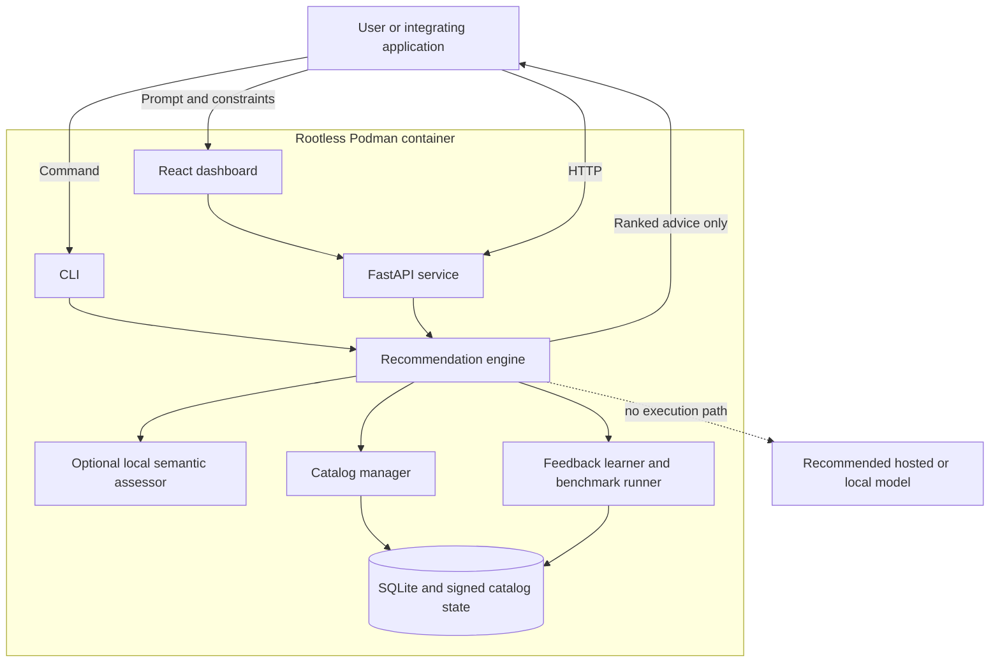
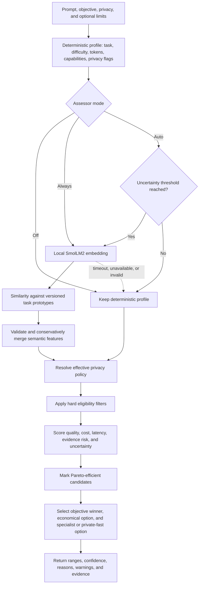
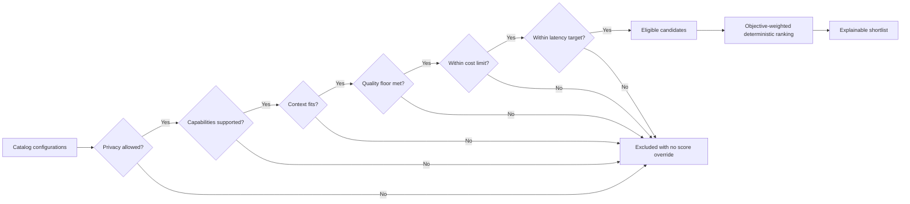
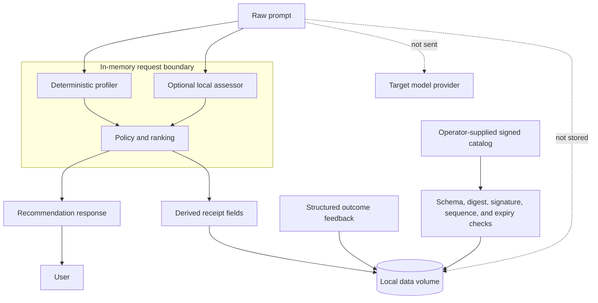
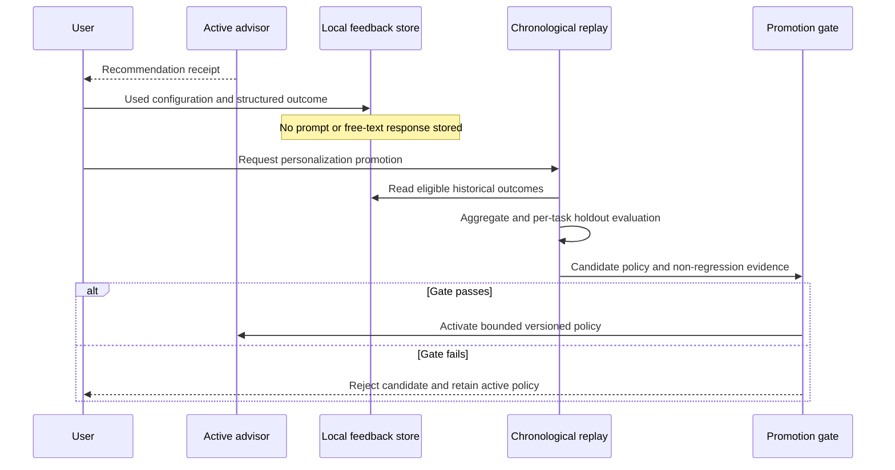
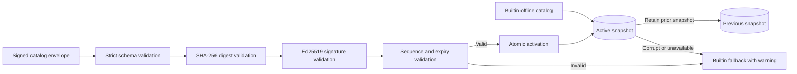
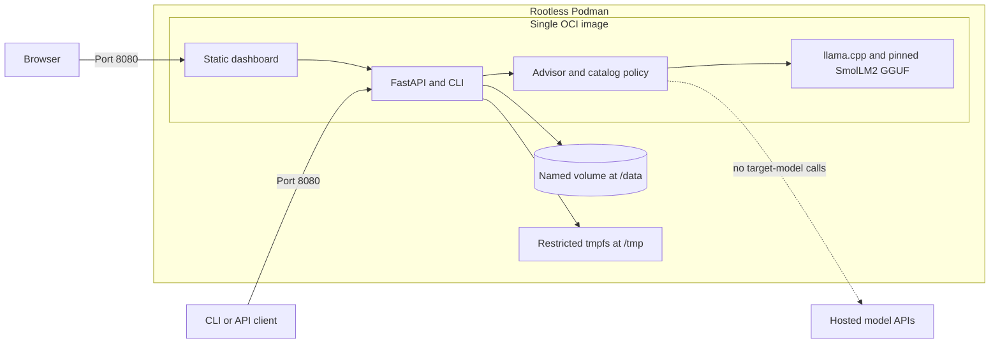

# Routellect architecture

Routellect is an advisory-only model selection system. It analyzes a prompt locally and recommends
an eligible LLM configuration, but it never sends the prompt to or invokes the recommended model.
This document describes the implemented `0.5.0` architecture.

## System context

The dashed edge is a deliberate non-capability: production code contains no target-model client,
provider API key flow, completion endpoint, or proxy.

## Recommendation pipeline

The assessor supplies a bounded semantic signal; it cannot see the catalog, prices, feedback,
scores, or selected model. A failed assessor cannot prevent deterministic advice.

## Decision authority and policy order

Privacy, capabilities, context, quality floor, budget, and latency are hard constraints. Neither
the assessor nor feedback can override them. Feedback can adjust an eligible candidate's score only
after its governed promotion gate succeeds, and its influence remains capped.

## Privacy and data flow

Recommendation receipts and feedback exclude the raw prompt. The local assessor has no network,
tools, memory, catalog access, or final-decision authority. Signed catalog imports are explicit
operator actions; recommendation requests do not refresh data from the network.

## Feedback and promotion loop

Individual outcomes never update live ranking immediately. Promotion is explicit, audited,
reversible, and subject to minimum support and non-regression checks.

## Catalog trust lifecycle

Catalog updates are imported from local files and activated atomically. Rollback retains a
monotonic high-water sequence so an older signed snapshot cannot silently replace newer evidence.

## Podman deployment

The runtime supports a read-only root filesystem, non-root user, dropped Linux capabilities, and
`no-new-privileges`. The model and runtime are bundled during the image build, allowing offline
operation after the image exists.

## Code map

| Concern | Primary implementation |
|---|---|
| API and dashboard serving | [`src/routellect/api.py`](../src/routellect/api.py) |
| Deterministic prompt profiling | [`src/routellect/profiler.py`](../src/routellect/profiler.py) |
| Bounded local assessor | [`src/routellect/assessor.py`](../src/routellect/assessor.py) |
| Eligibility, scoring, and shortlist | [`src/routellect/advisor.py`](../src/routellect/advisor.py) |
| Catalog validation and activation | [`src/routellect/catalog.py`](../src/routellect/catalog.py) |
| Feedback governance | [`src/routellect/learning.py`](../src/routellect/learning.py) |
| Local persistence | [`src/routellect/storage.py`](../src/routellect/storage.py) |
| Container build | [`Containerfile`](../Containerfile) |

Architectural decisions and their trade-offs are recorded in [`docs/adr`](adr/).
