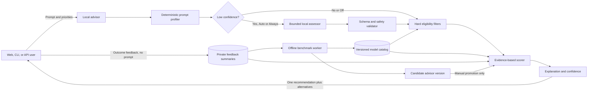
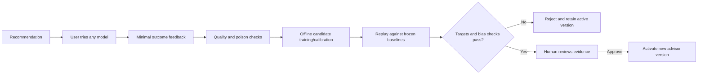

# Routellect System Architecture

Status: Proposed at Gate G1  
Style: Small modular monolith, advisory-only

## 1. Product boundary

Routellect reads a prompt and constraints, consults local evidence, and returns a recommendation. It uses a deterministic profiler first and, when uncertainty warrants it, a small local language-model assessor for structured semantic features. The assessor does not choose a model. The deterministic policy/scoring core remains the final authority. The product has no target-model client, provider credential support, completion endpoint, proxy, or execution path.



The prompt remains inside the service/container. Catalog updates may use the network only when an operator explicitly runs an update command; recommending never needs network access.

## 2. Modules

| Module | Responsibility |
|---|---|
| Interface | Web page, CLI, and versioned HTTP API |
| Profiler | Deterministic token estimate, task family, difficulty, capabilities, privacy signals, uncertainty trigger |
| Local assessor | Optional bounded semantic analysis for uncertain prompts; structured features only |
| Assessor validator | Schema, confidence, timeout, monotonic privacy/capability merge, safe fallback |
| Policy | Monotonic privacy and hard constraints |
| Catalog | Immutable model/configuration facts, prices, benchmarks, sources, freshness |
| Advisor | Eligibility, calibrated scoring, ranking, alternatives, confidence |
| Explanation | Plain-language reasons, evidence links, warnings, counterfactuals |
| Feedback | Consent, outcome capture, aggregation, export/delete/reset |
| Learning | Offline calibration/personalization, replay, candidate versions, bias checks |
| Benchmark | Frozen manifests, baselines, statistics, reports |
| Storage | SQLite for metadata/feedback; Parquet/DuckDB for benchmark observations |

There is no provider execution module. The local assessor has no tools, network, memory, catalog access, or final-decision authority. A package-boundary test will fail if production advisor code imports a provider SDK or performs outbound target-model requests.

## 3. Recommendation lifecycle

```mermaid
sequenceDiagram
    participant U as User
    participant A as Advisor
    participant P as Deterministic profiler
    participant L as Local assessor
    participant Y as Policy/validator
    participant C as Catalog
    participant S as Scorer
    participant F as Feedback store

    U->>A: Prompt + goal + privacy + optional constraints
    A->>P: Analyze locally
    P-->>A: Features + uncertainty
    opt Auto threshold reached or Always selected
        A->>L: Prompt, fixed schema, no tools/network
        L-->>A: Semantic feature proposal
    end
    A->>Y: Validate and monotonic-merge features
    Y-->>A: Effective privacy + requirements
    A->>C: Read frozen catalog snapshot
    C-->>A: Eligible facts and evidence
    A->>S: Features + candidates + user goal
    S-->>A: Ranked configurations + uncertainty + reasons
    A-->>U: Primary, alternatives, estimates, freshness
    U->>F: Optional outcome feedback; no prompt
```

State machine:

`received → fast_profiled → assessor_optional → validated → filtered → scored → recommended|no_match → returned → feedback_optional`

For the same normalized prompt, constraints, catalog, advisor version, feedback snapshot, and seed, the result is deterministic.

## 4. Simple interaction model

### Default input

- Prompt.
- Goal: balanced, best quality, lowest cost, or fastest.
- Privacy: standard, no-training, or local-only; no-training is the default.

### Advanced input

- Assessor mode: Off (safe G2 default), Auto (promotion candidate), or Always (evaluation).
- Expected output length.
- Maximum estimated cost and latency target.
- Minimum quality confidence bound.
- Required context, tools, structured output, vision, code, or reasoning.
- Allowed/excluded providers and models.
- Local hardware profile when local models are considered.

### Result

1. **Use this:** model, provider/runtime, and inference settings.
2. **Why:** no more than three concise reasons.
3. **Expected:** quality/confidence, cost range, latency range, and evidence date.
4. **Alternatives:** one cheaper and one stronger/faster eligible option.
5. **Feedback:** used/not used and worked/did not work.

Detailed scoring, rejected candidates, and evidence stay collapsed by default.

## 5. Catalog design

Each immutable `ModelConfiguration` records:

- Provider/runtime and concrete model version.
- Inference settings that materially affect quality/cost/latency.
- Modalities, tools, structured-output support, context/output limits, and task strengths.
- Input/cached-input/output/tool pricing with currency, units, tiers, and effective date.
- Public benchmark observations with dataset, prompt/evaluator provenance, sample count, and confidence.
- Latency ranges with region/hardware, runtime, quantization, and sample date.
- Privacy/retention/residency statements with source and review expiry.
- Local hardware requirements and locally available flag.

The image bundles a small usable catalog. `routellect catalog update` explicitly downloads or imports a candidate snapshot, validates it, shows changes, and activates it only after confirmation. Advice generated from stale evidence includes a warning or excludes the candidate under strict policy.

## 6. Hybrid prompt intelligence

### Deterministic fast path

The MVP first uses inexpensive local features:

- Length, language, requested output form, code/math markers, number of constraints, and multi-step cues.
- Task taxonomy: classification/extraction, summarization, writing, factual QA, research, math/reasoning, coding, tool/agent work, long-context, multimodal, or unknown.
- Difficulty band: simple, moderate, complex, frontier, or unknown.
- Capability requirements derived from explicit prompt evidence and user settings.
- Deterministic secret patterns plus optional local PII detection.
- A calibrated uncertainty score based on ambiguity, conflicting signals, unknown task class, and distance from validated examples.

### Local semantic assessor

In Auto mode, the assessor runs only when the uncertainty threshold fires. Always runs it for evaluation or difficult workflows; Off guarantees deterministic-only analysis. The exact CPU-capable model/runtime is selected at G2 using a frozen bake-off rather than brand preference.

The assessor receives the prompt and a fixed instruction/schema. It may propose only:

- Task family and difficulty distribution.
- Required capabilities and likely output form/length.
- Ambiguity, multi-step/reasoning, and domain indicators.
- Additional privacy-risk indicators.
- Its confidence and short machine-readable reason codes.

It cannot see model names, prices, benchmark rankings, feedback, or the final scoring policy, preventing it from directly choosing or favoring a model. It has no network, tools, memory, or free-form action channel. Output is schema-validated, bounded, and rejected on timeout, malformed values, or attempted instructions.

The validator conservatively combines both paths: user constraints are strongest; deterministic and assessor privacy/capability signals can make eligibility stricter but never weaker. Final model eligibility and ranking are ordinary deterministic code.

Prompt text is used in memory for analysis and discarded after the response. Receipts store only approved derived features and an optional tenant-keyed HMAC fingerprint.

## 7. Recommendation algorithm

### Eligibility first

A model configuration must satisfy:

`privacy/data-use ∧ provider allow-list ∧ modality/tools ∧ context ∧ local hardware ∧ catalog freshness ∧ estimated budget ∧ latency feasibility`

No preference weight can override a failed condition.

### Scoring

For each eligible configuration, estimate:

- `q`: task-quality expectation and uncertainty.
- `c`: input/output/tool cost range.
- `l`: latency range or local throughput estimate.
- `r`: evidence staleness and reliability risk.

Use a lower-confidence quality estimate `qLCB = q − κ·uncertainty`, then score the user's selected objective. Balanced mode uses normalized values:

`score = qLCB − λcost·cost_ratio − λlatency·latency_ratio − λrisk·risk`

The primary result is the highest-scoring non-dominated configuration. Alternatives are chosen for usefulness, not merely rank two and three: one cheaper option and one stronger/faster option when available. Assessor outputs influence only validated task/difficulty/capability features; they never contain or override a model score.

### Feedback adjustment

Benchmark evidence supplies the prior suitability of each task/model configuration. Confirmed user outcomes update a hierarchical Beta-style task/model posterior with shrinkage toward the global prior. Adjustments require minimum samples, have a capped influence, decay when stale, and include uncertainty.

This simple method is interpretable and safe for sparse data. Optional pairwise comparisons can later fit a small preference model. Contextual bandit methods remain experimental until replay shows a statistically supported benefit.

## 8. Feedback data model

Feedback contains:

- Recommendation ID and advisor/catalog versions.
- Assessor mode, version, whether it ran, and content-free confidence/feature summary.
- Derived task family/difficulty and chosen goal.
- Recommended model/configuration and model actually used.
- Used/not used, worked/did not work/unknown, optional 1–5 quality rating.
- Optional observed cost and latency.
- Optional pairwise winner when two models were tried.
- Timestamp and local workspace/tenant scope.

It excludes raw prompt, response, provider key, and free-text comments in v1. Users can disable learning, inspect summaries, export records, delete individual feedback, or reset all personalized learning.

## 9. Learning and promotion loop



No single feedback event changes production advice immediately. Every active version is reversible and records the evidence used for promotion.

## 10. Podman architecture

- One OCI image serves the built web assets, API, CLI entry point, local assessor, and worker.
- Multi-stage `Containerfile`: frontend build stage, Python dependency/build stage, minimal non-root runtime stage.
- Runtime user has no root privileges; application data lives at `/data` and temporary files at `/tmp`.
- One port, default `8080`; liveness and readiness health checks.
- Read-only root filesystem supported with a named volume for `/data` and tmpfs for `/tmp`.
- Catalog and feedback remain local in the mounted volume.
- No provider credentials or target-model runtimes in the image. The selected CPU assessor runtime and pinned quantized artifact are bundled so advice works offline without a first-run download.
- Build/test both `linux/arm64` and `linux/amd64` before release.

On macOS, Podman requires its Linux VM. Podman 6.1.0 is installed on the development host; machine initialization/start and image verification will occur at G2 with approval. Official references: [build](https://docs.podman.io/en/stable/markdown/podman-build.1.html), [machine](https://docs.podman.io/en/latest/markdown/podman-machine-init.1.html), and [health checks](https://docs.podman.io/en/latest/markdown/podman-healthcheck.1.html).

## 11. Technology baseline

- Python 3.12, FastAPI, Pydantic, SQLite, DuckDB/Parquet, and scikit-learn.
- One CPU inference runtime and pinned compact local language model, chosen by the G2 assessor bake-off; no runtime model download.
- React/TypeScript dashboard compiled into static assets served by FastAPI.
- Provider-neutral catalog importers; no provider SDKs in production advisor code.
- pytest/property tests, API schema tests, Playwright accessibility/browser tests, and container structure tests.
- Structured content-free logs and Prometheus-compatible metrics.

## 12. Architecture acceptance tests

- Advisory endpoints make zero target-provider requests and require no provider keys.
- The local assessor makes zero network/tool calls, cannot access the catalog/ranker, and falls back safely on timeout or invalid output.
- Auto runs the assessor only at/above the calibrated uncertainty threshold; Off never loads or invokes it.
- Hybrid mode must beat deterministic-only and content-blind/fixed-tier controls on held-out prompt-specific utility before it becomes the default active path.
- Local-only prompts never recommend hosted models; no-training prompts exclude configurations whose dated evidence does not satisfy that requirement.
- Raw prompts and detected secrets are absent from logs, receipts, feedback, database, browser storage, and exports.
- The same frozen inputs produce the same recommendation.
- Stale or incomplete catalog evidence cannot appear as a confident recommendation.
- Feedback cannot affect active advice until a candidate version passes replay and is approved.
- Deleting/resetting feedback removes its personalized effect.
- The rootless Podman container starts, passes health checks, persists `/data`, works with read-only root, and serves web/API without runtime internet.
